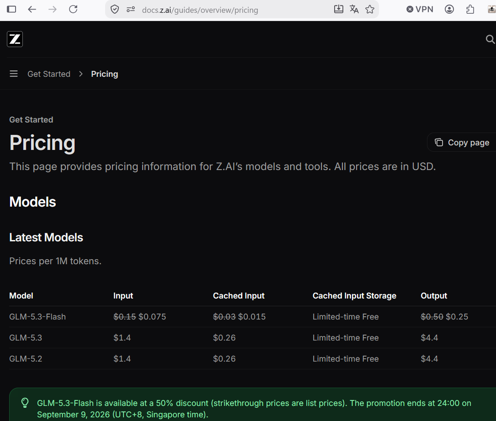
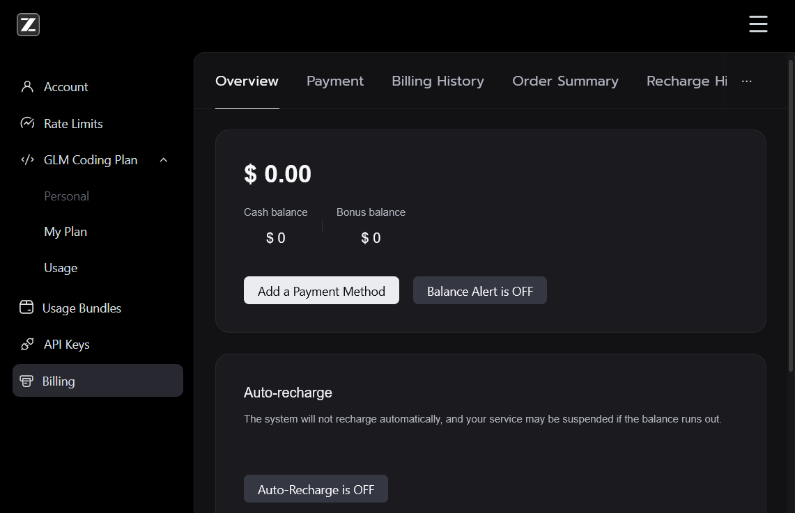
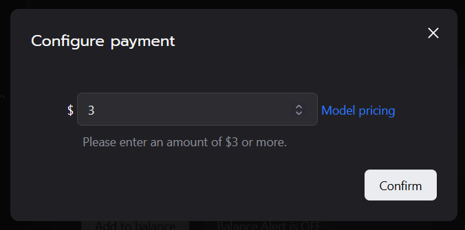
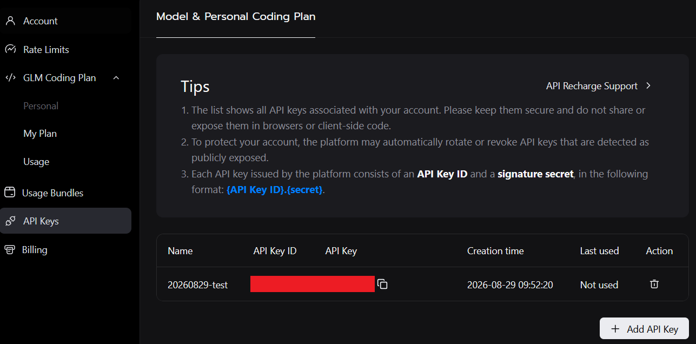
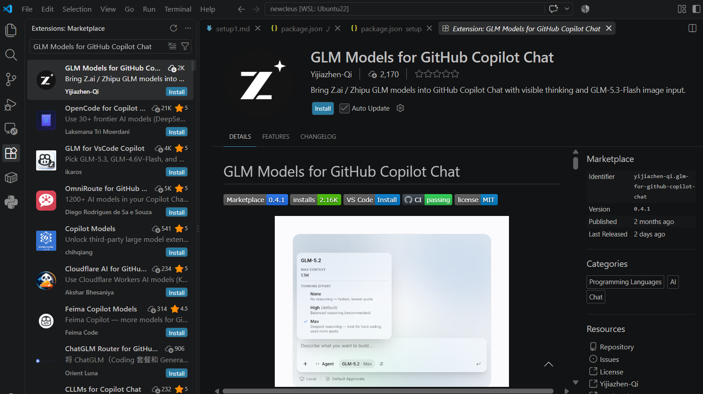
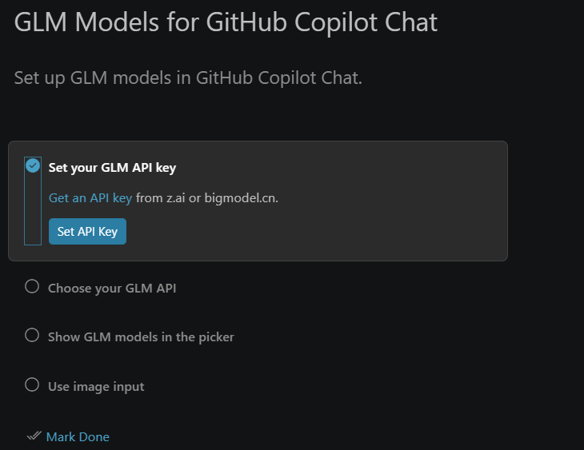
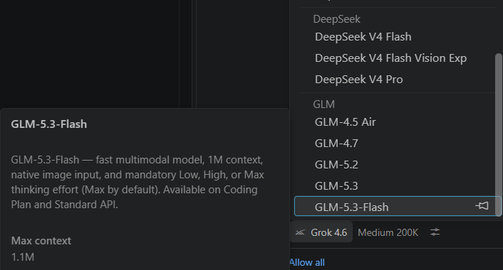

# GLM-5.3-Flash 調査メモ

> **作成日:** 2026-08-29
> **情報源（一次情報）:**
>
> - Z.ai 公式ブログ: <https://z.ai/blog/glm-5.3-flash>（2026-08-26 公開）
> - Z.ai 公式料金ページ: <https://docs.z.ai/guides/overview/pricing>
> - Z.ai 公式モデルガイド（GLM-5.3-Flash）: <https://docs.z.ai/guides/llm/glm-5.3-flash>
> - DeepSeek API 料金ページ: <https://api-docs.deepseek.com/quick_start/pricing/>
> - DeepSeek Change Log: <https://api-docs.deepseek.com/updates/>
> - VS Code Marketplace（GLM Models for GitHub Copilot Chat）: <https://marketplace.visualstudio.com/items?itemName=yijiazhen-qi.glm-for-github-copilot-chat>
>
> ※ 価格・仕様は変動する可能性があります。最新情報は必ず一次情報で確認してください。
> ※ スクリーンショットはすべて `docs/glm53/` 配下の実機キャプチャ（2026-08-29 取得）です。

---

## 目次

1. [GLM-5.3-Flash の注目ポイント](#1-glm-53-flash-の注目ポイント)
2. [価格（Z.ai API）](#2-価格zai-api)
3. [DeepSeek-V4-Flash-Vision-Exp との比較](#3-deepseek-v4-flash-vision-exp-との比較)
4. [VS Code / GitHub Copilot への導入方法](#4-vs-code--github-copilot-への導入方法)
5. [参考情報源](#5-参考情報源)

---

## 1. GLM-5.3-Flash の注目ポイント

### 1.1 モデル概要

| 項目 | 内容 |
| --- | --- |
| モデルコード | `glm-5.3-flash` |
| リリース | 2026-08-26（Z.ai / Zhipu AI） |
| アーキテクチャ | MoE、総パラメータ **320B** / アクティブ **18B**、45 層 |
| コンテキスト長 | **1M tokens** |
| 最大出力トークン | **128K** |
| 入力モダリティ | **Video / Image / Text / File**（GLM-5 シリーズ初のネイティブマルチモーダル） |
| 出力モダリティ | Text |
| 思考モード | **常時 ON**（`thinking.type` は `enabled` のみ。Thinking Effort は Low / High / **Max（既定）**） |
| 推奨パラメータ | `temperature: 1`、`top_p: 0.95`、`reasoning_effort: max` |
| ライセンス | **MIT**（オープンウェイト: HuggingFace `zai-org/GLM-5.3-Flash`、FP8 / BF16） |
| ローカル推論 | SGLang / vLLM / TokenSpeed 対応 |

### 1.2 注目ポイント

1. **Flash 価格でフロンティア級の性能**
   - Artificial Analysis Intelligence Index v4.1.1 で **57** を **$0.045/task（割引適用時）** で達成。これまで約 10 倍のコストが必要だった水準の知能を、コストのパレートフロンティアを押し上げて実現。
   - コーディング・エージェント系ベンチマークで **GLM-5.2 を大きく上回り**、**Claude Opus 4.8 に接近**。
     - DeepSWE v1.1: **63.4**（GLM-5.2: 46.2）
     - AutomationBench v1.0.6: **48.8**（GLM-5.2: 26.2）
     - Terminal Bench 2.1: **84.3**（Opus 4.8: 85.0 に肉薄）
   - Z.ai Code Bench v1.0（Claude Code 上）では Max effort 時に Opus 4.8 ほぼ同等（29.0 vs 29.5）。

2. **超効率アーキテクチャ**
   - **スパース注意 + 線形注意のハイブリッドアーキテクチャ**（GLM シリーズ初）。線形注意が局所依存を状態モデリングで捉え、スパース注意が軽量インデクサで大域文脈を検索。
   - 1M トークン文脈でのインデクサのオーバーヘッドを **IndexPool**（4 つのインデクサキー ベクトルを重み付きプーリングで 1 本に圧縮）で削減。
   - **Manifold-Constrained Hyper-Connections (mHC)** によるスケーリング効率改善。
   - 結果として GLM-5.3 比で **attention 計算量 3.0 倍削減、KV キャッシュ 4.4 倍削減**。層数も GLM-4.5 系の 92 → **45** に半減（アクティブパラメータ 32B → 18B）。
   - 30T トークンのマルチモーダル事前学習コーパスと組み合わせ「少ない計算でより高い知能」を実現。

3. **ネイティブマルチモーダル（Video / Image / Text / File 入力）**
   - **ビジュアルコーディング**: スクリーンショット・複数ページ画像・サイト URL・画面録画から、デザインシステム・ページ間関係・インタラクション状態まで理解して完全なフロントエンドプロジェクトを生成し、レンダリング結果を自己検証しながら反復改善。
   - **Office 生成**: PPTX / PDF / DOCX / XLSX を、レンダリング検査（文字溢れ・重なり・スタイル不整合の検出と修正）込みで作成。
   - その他、動画編集エージェント（話者認識・字幕付け）、3D モデリング（Blender）、ゲームプロトタイピング（Godot）などのユースケースが公式に示されている。
   - MMVU **80.5**（Opus 4.8: 67.4）など動画理解でも高スコア。

4. **GLM Coding Plan で 3 倍のクォータ**
   - GLM-5.3 比で **利用可能クォータ 3 倍**。ポイント制クォータ導入で、**オフピーク帯（週末終日を含む）は標準ポイントの 50%** で利用可能。

5. **中国製 AI チップでの大規模サービング実績**
   - SGLang ベースの専用推論エンジン、W8A8 量子化、INT8/FP8/BF16 混合キャッシュ量子化、Encode–Prefill–Decode (EPD) 分離アーキテクチャにより、中国製 AI チップクラスタで運用。ベースライン比 **3 倍のエンドツーエンド性能**を達成し、NVIDIA GPU 並みのトークン当たりコストを実現と主張。
   - リリース前は `ox-alpha` 名義で OpenCode / OpenRouter に匿名公開され、**週間最人気モデル**になった。

6. **オープンウェイト（MIT）**
   - HuggingFace / ModelScope で重み公開。SGLang / vLLM / TokenSpeed でローカル推論可能。

---

## 2. 価格（Z.ai API）

### 2.1 Standard API 料金（per 1M tokens, USD）

出典: [docs.z.ai/guides/overview/pricing](https://docs.z.ai/guides/overview/pricing)（実機スクリーンショット: `docs/glm53/20260829_z_ai_pricing.png`）

| モデル | Input | Cached Input | Cached Input Storage | Output |
| --- | --- | --- | --- | --- |
| **GLM-5.3-Flash** | ~~$0.15~~ **$0.075** | ~~$0.03~~ **$0.015** | 期間限定無料 | ~~$0.50~~ **$0.25** |
| GLM-5.3 | $1.4 | $0.26 | 期間限定無料 | $4.4 |
| GLM-5.2 | $1.4 | $0.26 | 期間限定無料 | $4.4 |

> 💡 **GLM-5.3-Flash は 50% 割引キャンペーン中**（打ち消し線が定価）。キャンペーン終了は **2026-09-09 24:00（UTC+8 / シンガポール時間）**。


*docs.z.ai の料金ページ。GLM-5.3-Flash が定価の 50% で提供されていることが分かる。GLM-5.3 / GLM-5.2 は $1.4 / $0.26 / $4.4。*

### 2.2 GLM Coding Plan

- サブスクリプション制（[z.ai/subscribe](https://z.ai/subscribe)）。GLM-5.3-Flash は **GLM-5.3 の 3 倍の利用可能クォータ**。
- ポイント制クォータ。**オフピーク帯・週末終日は標準ポイントの 50% 消費**。
- GLM-5.3 は Coding Plan 専用、GLM-5.3-Flash は **Coding Plan と Standard API の両方**で利用可能。

### 2.3 課金・チャージ（実機キャプチャ）

**Billing 概要** — `Cash balance`（現金残高）と `Bonus balance`（ボーナス残高）を管理。`Auto-Recharge` が OFF の場合、「残高が尽きるとサービスが停止する可能性がある」と警告が出る。


*z.ai コンソールの Billing 画面。残高 $0.00 の状態。Payment / Billing History / Order Summary / Recharge History などのタブがある。*

**最低チャージ額 $3** — Billing → `Add to balance` で開く「Configure payment」ダイアログでは、**$3 以上**の入力が必須（`Please enter an amount of $3 or more.`）。


*チャージ金額入力ダイアログ。最小 $3。右の「Model pricing」リンクから料金ページに飛べる。*

**API キーの管理** — コンソール左メニューの `API Keys` から発行。キーは **`(API Key ID).(secret)` 形式**。公開露出が検出されたキーは自動でローテート / 失効される場合がある。


*z.ai コンソールの API Keys 一覧。「Add API Key」ボタンで新規発行。作成直後（Last used: Not used）の状態。*

---

## 3. DeepSeek-V4-Flash-Vision-Exp との比較

DeepSeek-V4-Flash-Vision-Exp（モデル ID: `deepseek-v4-flash-vision-exp`）は DeepSeek が **2026-08-21** に API プラットフォームへ公開した実験的（`-exp`）マルチモーダルモデル。テキスト性能は DeepSeek-V4-Flash と同等で、視覚理解を追加したモデル。

### 3.1 モデル仕様の比較

| 項目 | **GLM-5.3-Flash** | **DeepSeek-V4-Flash-Vision-Exp** |
| --- | --- | --- |
| 公開日 | 2026-08-26 | 2026-08-21（実験的モデル） |
| 提供形態 | API + **オープンウェイト（MIT, FP8/BF16）** | API のみ（重み非公開） |
| パラメータ | 320B（A18B / MoE） | 非公開 |
| コンテキスト長 | 1M | 1M |
| 最大出力 | 128K | **最大 384K** |
| 入力モダリティ | **Video / Image / Text / File** | Image（+ Text）※画像はトークン化され入力課金 |
| 思考モード | **常時 ON**（Low / High / Max、既定 Max） | thinking / non-thinking の**切替可能**（既定 thinking） |
| 主な対応機能 | function calling、JSON / 構造化出力、コンテキストキャッシュ、ストリーミング | JSON Output、Tool Calls、**Responses API**、**Anthropic API**、Chat Prefix Completion（Beta）。**FIM Completion 非対応** |
| 同時実行数上限 | -（レート制限はプラン別） | 2,500 |
| ベース URL | `https://api.z.ai` | `https://api.deepseek.com`（OpenAI 形式）/ `https://api.deepseek.com/anthropic`（Anthropic 形式） |

### 3.2 価格の比較（per 1M tokens, USD）

DeepSeek は**ピーク／オフピーク時間帯課金**。ピークは **UTC で月〜金 01:00–04:00 と 06:00–10:00**、それ以外はすべてオフピーク（週末は終日オフピーク）。オフピークはピークの半額。

| 項目 | **GLM-5.3-Flash**（Z.ai） | **DeepSeek-V4-Flash-Vision-Exp** |
| --- | --- | --- |
| 入力（通常 / cache miss） | ~~$0.15~~ **$0.075**（割引中） | **$0.44**（peak）/ **$0.22**（off-peak） |
| 入力（キャッシュヒット） | ~~$0.03~~ **$0.015** | **$0.014**（peak）/ **$0.007**（off-peak） |
| 出力 | ~~$0.50~~ **$0.25** | **$1.32**（peak）/ **$0.66**（off-peak） |

読み解き:

- **割引適用中の GLM-5.3-Flash は DeepSeek のオフピーク比でも入力約 1/2.9、出力約 1/2.6**。ピーク帯比では入力約 1/5.9、出力約 1/5.3 と、さらに差が開く。
- キャンペーン終了後（定価）でも入力 $0.15 / 出力 $0.50 で、DeepSeek オフピーク比で入力約 1/1.5・出力約 1/1.3 と安価。
- ただし **キャッシュヒット入力は DeepSeek オフピーク（$0.007）が最安**。長文コンテキストの再利用が多いワークロードではキャッシュ戦略次第で差が縮む。
- 画像課金は両社とも入力トークンとして課金。DeepSeek は画像を寸法に応じてトークン化（公式 Vision ガイドの換算ルールに従う）。
- Z.ai の割引は **2026-09-09 まで**の期間限定。DeepSeek は価格変更の権利を留保している。

### 3.3 ベンチマークの比較

Z.ai 公式ブログが公開している対戦表（GLM-5.3-Flash vs DeepSeek-V4-Vision-Exp 列を抽出。他社比較は元記事参照）:

| Benchmark | **GLM-5.3-Flash** | **DeepSeek-V4-Flash-Vision-Exp** | 勝者 |
| --- | --- | --- | --- |
| **Coding** | | | |
| Terminal Bench 2.1 | **84.3** | 83.9 | GLM（僅差） |
| DeepSWE v1.1 | **63.4** | 59.3 | GLM |
| NL2Repo | 56.3 | **57.7** | DeepSeek |
| **Agentic** | | | |
| Toolathlon Verified | **78.4** | 75.9 | GLM |
| AutomationBench v1.0.6 | **48.8** | 38.8 | GLM |
| Agents' Last Exam | 26.3 | **27.3** | DeepSeek（僅差） |
| HLE w/ Tools | **55.3** | 55.1 | ほぼ互角 |
| GDPval-AA v2 | **1773** | 1675 | GLM |
| **Vision** | | | |
| OfficeQA Pro | **62.4** | 57.9 | GLM |
| CharXiv Reasoning w/ Tools | **89.4** | 80.4 | GLM |
| Chartography w/ Tools | **78.0** | 64.3 | GLM |
| BabyVision | **53.4** | 35.1 | GLM |
| MVBench | **77.8** | 69.4 | GLM |
| MMVU | **80.5** | 72.7 | GLM |

補足（DeepSeek 公式 Change Log 2026-08-21 のセルフ評価値）:

- Terminal Bench 2.1: 83.9 / NL2Repo: 57.7 / DeepSWE: 59.3 / DSBench-Hard: 63.6 / AutomationBench (Public): 25.7 / ApexBench (Pass@1): 36.5 / Agents' Last Exam: 27.3 / Chartography: 64.3 / ZeroBench (Pass@5): 35.0
- DeepSeek は「純テキスト性能は DeepSeek-V4-Flash と同等、視覚理解を要するエージェントベンチでは Opus-4.8 に接近」と主張。

### 3.4 選択指針のまとめ

| 観点 | 推奨 |
| --- | --- |
| コスト最優先（現在時点） | **GLM-5.3-Flash**（50% 割引中で最安。09-09 以降も定価で DeepSeek オフピーク比で安い） |
| 長い出力（最大 384K）が必要 | **DeepSeek-V4-Flash-Vision-Exp**（GLM は 128K まで） |
| thinking の ON/OFF 制御 | **DeepSeek**（GLM-5.3-Flash は思考常時 ON・Max 既定でトークン消費が増えやすい） |
| 画像・動画理解の幅 | **GLM-5.3-Flash**（Video 入力対応、Vision 系ベンチで全面的に優位） |
| セルフホスト | **GLM-5.3-Flash**（MIT オープンウェイト） |
| Anthropic 形式 API / Responses API | **DeepSeek**（公式対応） |
| サブスクで使う（従量課金を避けたい） | GLM Coding Plan（GLM-5.3-Flash が 3 倍クォータ対象） |

> ⚠️ 注意: Z.ai ブログ掲載のベンチマーク表は Z.ai 自身がハーネスを指定して実施したもの。DeepSeek 公表値と測定条件（フレームワーク・パラメータ）が異なる場合があるため、絶対値よりも傾向として捉えること。

---

## 4. VS Code / GitHub Copilot への導入方法

GLM モデルは GitHub Copilot Chat 標準のモデル一覧には含まれないため、**BYOK（Bring Your Own Key）型のコミュニティ拡張**「**GLM Models for GitHub Copilot Chat**」（Publisher: Yijiazhen-Qi / ID: `yijiazhen-qi.glm-for-github-copilot-chat` / v0.4.1 / MIT / 約 2,170 インストール、2026-08-29 時点）を導入する。

> ⚠️ **非公式のコミュニティ製拡張**です。Zhipu AI / Z.AI / GitHub / Microsoft とは非提携。API キーは自己保有・自己課金（BYOK）。


*拡張機能パネルで「GLM Models for GitHub Copilot Chat」を検索した様子。類似拡張（OpenCode for Copilot、GLM for VsCode Copilot など）と並んで表示される。Copilot のネイティブな思考 UI に Thinking Effort（None / High(既定) / Max）が連携する。*

### 4.1 前提条件

- **VS Code 1.127 以降**
- **GitHub Copilot サブスクリプション**（Free / Pro / Enterprise いずれか）
- **GLM API キー**（[z.ai](https://z.ai/manage-apikey/apikey-list) または [bigmodel.cn](https://open.bigmodel.cn/usercenter/proj-mgmt/apikeys) で発行）もしくは GLM Coding Plan 契約

### 4.2 インストール手順

1. 拡張機能パネル（`Ctrl/Cmd + Shift + X`）で **「GLM Models for GitHub Copilot Chat」** を検索してインストール。
2. コマンドラインからの場合:

   ```bash
   code --install-extension yijiazhen-qi.glm-for-github-copilot-chat
   ```

3. 旧 Marketplace 配信 ID（`YijiazhenQi.glm-for-copilot-chat`）から移行する場合は**先に旧版をアンインストール**（同一の `glm-copilot.*` コマンド/設定が競合するため）:

   ```bash
   code --uninstall-extension YijiazhenQi.glm-for-copilot-chat
   code --install-extension yijiazhen-qi.glm-for-github-copilot-chat
   ```

### 4.3 API キーの取得（z.ai の場合）

1. <https://z.ai> にサインアップし、コンソール左メニュー **API Keys** を開く。
2. **Add API Key** でキーを発行（キー形式は `(API Key ID).(secret)`）。
3. 利用には残高が必要。**Billing → Add to balance で最低 $3 からチャージ**（[§2.3](#23-課金チャージ実機キャプチャ)のスクリーンショット参照）。Auto-Recharge を ON にしておくと残高尽きによる停止を回避できる。

### 4.4 セットアップ（Walkthrough）

インストールすると Getting Started（Walkthrough）が表示される。手順は以下の 4 ステップ:

1. **Set your GLM API key** — 「Get an API key from z.ai or bigmodel.cn」リンクからキーを取得し、**Set API Key** ボタン（コマンドパレットでは `GLM: Set API Key`）で貼り付け。
2. **Choose your GLM API** — Coding Plan か Standard API か、リージョン（international / china）を選択。
3. **Show GLM models in the picker** — Copilot Chat のモデルピッカーに GLM モデルが並ぶ。
4. **Use image input** — GLM-5.3-Flash による画像入力の確認。

完了したら **Mark Done**。


*Walkthrough 画面。最初のステップ「Set your GLM API key」に [Set API Key] ボタンがあり、クリックしてキーを登録する。*

キーは **VS Code `SecretStorage`（OS のキーチェーン）** に保存される。実キーをワークスペース設定（settings.json）に書くのは非推奨（CI 用の設定フォールバックはある）。

### 4.5 モデルの選択と Thinking Effort

Copilot Chat を開くと、モデルピッカーに GLM モデル（GLM-5.3 / GLM-5.3-Flash / GLM-5.2 / GLM-4.7 / GLM-4.5 Air）が表示される。**GLM-5.3 が既定モデル**になる（`chat.defaultModel` のユーザー/組織設定があればそちらが優先）。


*モデルピッカーの例。DeepSeek 系（V4 Flash / V4 Flash Vision Exp / V4 Pro）と GLM 系が並び、GLM-5.3-Flash がハイライトされている。ツールチップには「fast multimodal model, 1M context, native image input, mandatory Low / High / Max thinking effort (Max by default)」と表示される。*

- **GLM-5.3-Flash**: 1M コンテキスト・ネイティブ画像入力。**Thinking Effort は Low / High / Max（既定 Max）で常時思考**。Coding Plan / Standard API どちらでも使用可。
- **GLM-5.3**: 既定のコーディングモデル（1M / 128K）。**Coding Plan のみ**で提供（Standard API のカタログには未掲載のためピッカーから除外される）。
- テキスト専用モデルに画像を貼ると、拡張機能が **GLM-5.3-Flash に画像の説明を生成させ、untrusted visual context として渡す**フォールバック動作をする（画像内のテキストは文脈であって指示・認可ではない）。

### 4.6 主な設定（`glm-copilot.*`）

| 設定 | 既定値 | 説明 |
| --- | --- | --- |
| `glm-copilot.apiMode` | `coding-plan` | `coding-plan` または `standard` |
| `glm-copilot.region` | `international` | `international`（z.ai）/ `china`（bigmodel.cn） |
| `glm-copilot.baseUrl` | （空） | 互換エンドポイントの上書き。apiMode / region より優先され、公式のモデル可用性フィルタをスキップ |
| `glm-copilot.maxTokens` | `0` | リクエストあたり最大出力トークン（0 は API 既定） |
| `glm-copilot.thinking` | `enabled` | Thinking Effort ピッカーのないモデル向けの ON/OFF |
| `glm-copilot.customModels` | `[]` | 独自モデルの追加（`{ id, name?, maxInputTokens?, ... , nativeImageInput? }`） |
| `glm-copilot.showUsageStatusBar` | `true` | ステータスバーにクォータ/残高を表示（100% / 残高 0 で赤表示） |
| `glm-copilot.usageRefreshIntervalMinutes` | `5` | 使用量ステータスバーの更新間隔 |

### 4.7 API モード別エンドポイント

| モード | リージョン | エンドポイント | キー取得先 |
| --- | --- | --- | --- |
| Coding Plan | International | `https://api.z.ai/api/coding/paas/v4` | [z.ai/manage-apikey/subscription](https://z.ai/manage-apikey/subscription) |
| Coding Plan | 中国本土 | `https://open.bigmodel.cn/api/coding/paas/v4` | [bigmodel.cn/coding-plan](https://bigmodel.cn/coding-plan/personal/overview) |
| Standard | International | `https://api.z.ai/api/paas/v4` | [z.ai/manage-apikey/apikey-list](https://z.ai/manage-apikey/apikey-list) |
| Standard | 中国本土 | `https://open.bigmodel.cn/api/paas/v4` | [open.bigmodel.cn](https://open.bigmodel.cn/usercenter/proj-mgmt/apikeys) |

### 4.8 その他の機能

- **画像入力**: PNG / JPEG を貼り付け可能。最大 16 枚・1 枚 5MB まで。MCP サーバーやローカルパッケージ、別途 Vision キーは不要。
- **使用量トラッキング**: `GLM: Show Usage Details` パネルで Coding Plan のセッション（5 時間）/ 週間（7 日）トークン上限・リセットカウント、Standard API の現金残高・トークンパッケージを確認可能。`GLM: Refresh Usage` で即時更新。
- **その他のコマンド**: `GLM: Get API Key`（キー管理ページを開く）/ `GLM: Clear API Key` / `GLM: Open Settings` / `GLM: Show Logs` / `GLM: Edit Flash Image Analysis Prompt`。
- **ランタイム依存ゼロ**: Python / Docker / MCP サーバー不要。Copilot のネイティブ Language Model Provider API を使用するため、**エージェントモード・ツール呼び出し・チャット履歴を保ったままのモデル切替**がそのまま動く。

### 4.9 DeepSeek モデルとの併用

スクリーンショット（[§4.5](#45-モデルの選択と-thinking-effort)）の通り、Copilot Chat のピッカーには **DeepSeek 系モデル（V4 Flash / V4 Flash Vision Exp / V4 Pro）が Copilot 側のモデルとして並んでおり**、GLM 拡張と同じピッカーから両者を切り替えて比較利用できる。コスト重視なら GLM-5.3-Flash、長文出力や thinking 制御が必要なら DeepSeek-V4-Flash-Vision-Exp、という使い分けが可能。

---

## 5. 参考情報源

| 内容 | URL |
| --- | --- |
| GLM-5.3-Flash 公式ブログ | <https://z.ai/blog/glm-5.3-flash> |
| Z.ai 料金ページ | <https://docs.z.ai/guides/overview/pricing> |
| GLM-5.3-Flash モデルガイド | <https://docs.z.ai/guides/llm/glm-5.3-flash> |
| DeepSeek Models & Pricing | <https://api-docs.deepseek.com/quick_start/pricing/> |
| DeepSeek Change Log（Vision-Exp リリース） | <https://api-docs.deepseek.com/updates/> |
| DeepSeek Vision ガイド（画像トークン換算） | <https://api-docs.deepseek.com/guides/vision#token-usage> |
| GLM Models for GitHub Copilot Chat（Marketplace） | <https://marketplace.visualstudio.com/items?itemName=yijiazhen-qi.glm-for-github-copilot-chat> |
| GLM-5.3-Flash オープンウェイト | <https://huggingface.co/zai-org/GLM-5.3-Flash> |

> 付属スクリーンショット一覧（`docs/glm53/`）:
> `20260829_vscode_GLM_Models_for_GitHub_Copilot_Chat.png`（拡張機能ページ）/
> `20260829_Set_API_Key.png`（Walkthrough）/
> `20260829_api_key.png`（API キー発行）/
> `20260829_z_ai_pricing.png`（料金ページ）/
> `20260829_z_ai_billing.png`（Billing 概要）/
> `20260829_Please_enter_an_amount_of_3_or_more.png`（最低チャージ $3）/
> `20260829_Select_model.png`（モデルピッカー）
