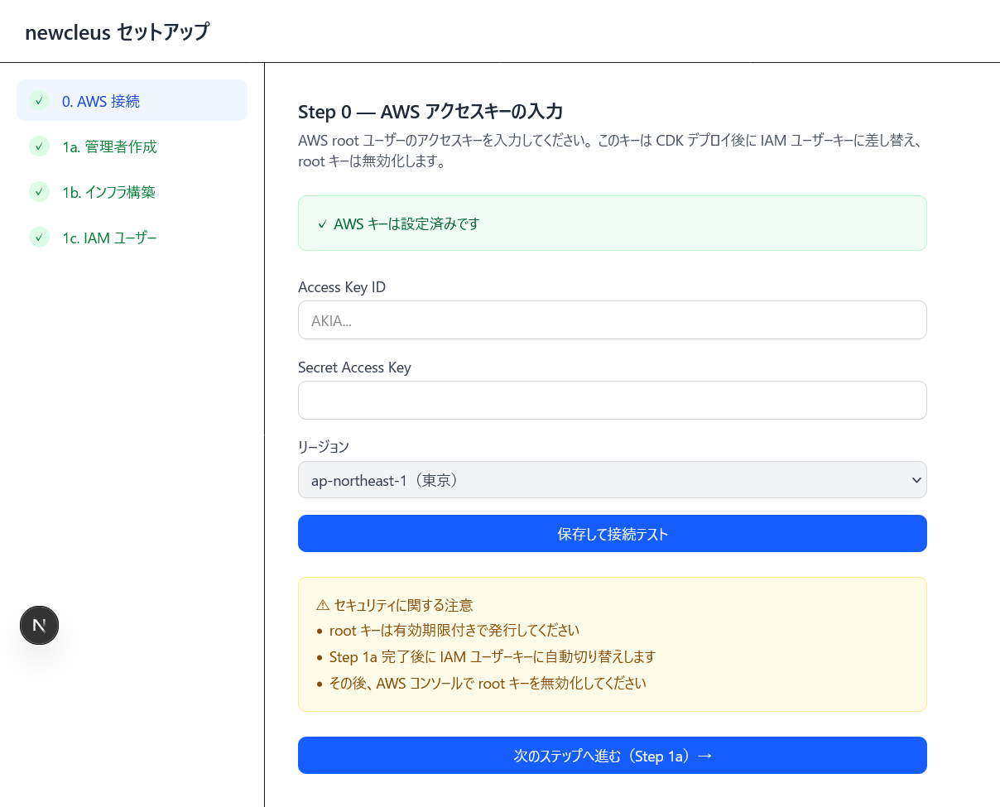
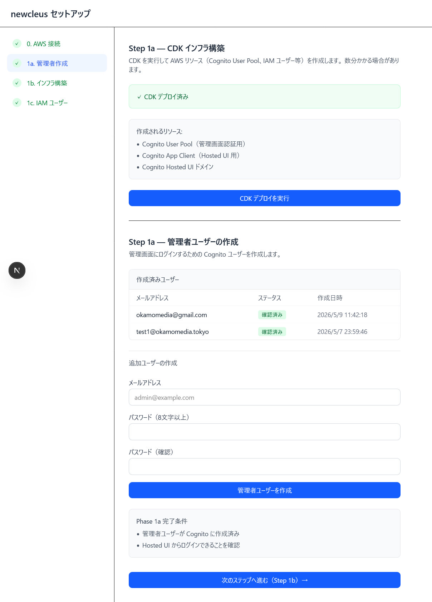
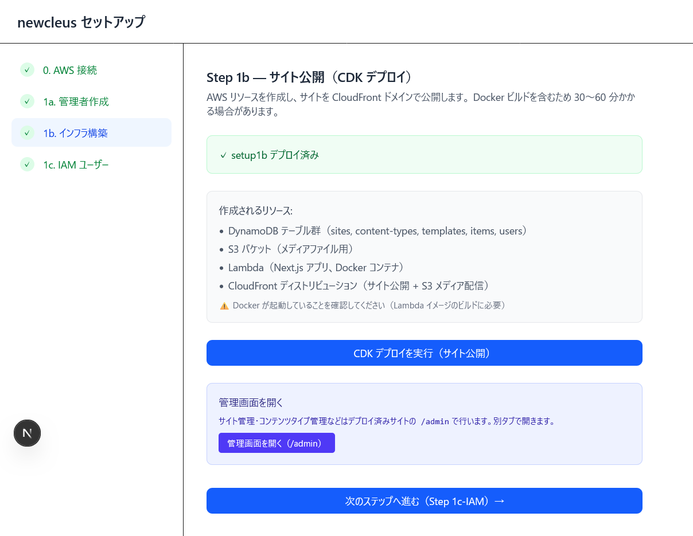
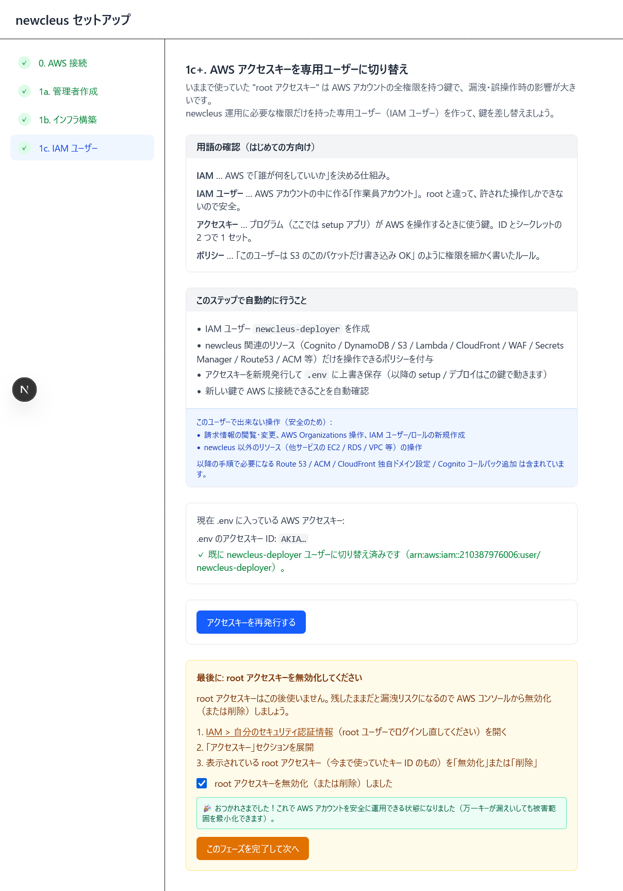

# newcleus セットアップ手順書 — サイト公開まで

> **このパートのゴール:** AWS アカウントを準備し、CloudFront ドメイン（`xxx.cloudfront.net`）でサイトと管理画面を公開する。

セットアップ画面は配布用 WSL イメージを起動すると `http://localhost:3001` で開きます。下記「事前準備」でWSLからセットアップ画面を起動してから Step 0 以降に進んでください。

---

## 事前準備 — セットアップ画面を起動する

### セットアップ画面の動作環境

| 項目 | 要件 |
|---|---|
| OS | Windows 11（64bit） |
| CPU | x64（仮想化支援機能が有効） |
| メモリ | 8 GB 以上推奨（4 GB でも可。WSL2 による追加消費あり） |
| ディスク空き | 10 GB 以上（DL 中約 1.5 GB、VHDX 展開後数 GB） |
| ネットワーク | GitHub Releases へアクセス可能（初回のみ。以降はオフラインで起動可） |
| ポート | TCP `3001` がローカルで利用可能であること |
| 権限 | 管理者権限必要 |

## WSL イメージのインポートとセットアップ画面の起動

### 1. WSL イメージをダウンロードする

以下の URL から `newcleus-latest.tar.gz` をダウンロードします。

```
https://github.com/okamoto53515606/newcleus/releases/latest/download/newcleus-latest.tar.gz
```

ブラウザで開くかリンクを右クリックして「名前を付けて保存」。ここでは `C:\Users\<あなたのユーザー名>\Downloads\newcleus-latest.tar.gz` に保存したとします。

> **why:** ファイルサイズは約 1.5 GB です。モバイル回線では時間がかかります。Wi-Fi 環境でどうぞ。

---

### 2. WSL 2 を有効化する

PowerShell を**管理者権限**で開き、以下を実行します（初回のみ）。

```powershell
wsl --install --no-distribution
```

再起動を求められたら再起動してください。すでに WSL 2 が有効な場合はスキップできます。

---

### 3. WSL イメージをインポートする

PowerShell（管理者不要）で実行します。`<あなたのユーザー名>` を自分のユーザー名に置き換えてください。

```powershell
# インポート先フォルダを作成（任意のパスで OK）
New-Item -ItemType Directory -Force -Path "C:\wsl\newcleus"

# インポート実行（数分かかります）
wsl --import newcleus C:\wsl\newcleus C:\Users\<あなたのユーザー名>\Downloads\newcleus-latest.tar.gz --version 2
```

完了したら以下で確認：

```powershell
wsl --list --verbose
```

`newcleus` が `Running` または `Stopped` で一覧に出れば成功です。

---

### 4. セットアップ画面を起動する

PowerShell から以下を実行します：

```powershell
wsl -d newcleus -u ubuntu -- bash -i /home/ubuntu/newcleus/setup/start.sh
```

しばらく待つと以下のようなログが表示されます：

```
▲ Next.js 16.x.x
- Local: http://localhost:3001
```

---

### 5. ブラウザでセットアップ画面を開く

ブラウザで以下を開きます：

```
http://localhost:3001
```

setup0 画面が表示されたら準備完了です。以下の「Step 0」から作業を開始してください。

> **セットアップ画面を停止するには:** PowerShell で `Ctrl+C` を押します。次回起動も同じ Step 4 のコマンドで再開できます（途中から再開できます）。

---

## 全体像

| Step | 画面 | 何をやるか | 担当ツール |
|---|---|---|---|
| 0 | `/setup0` | AWS アクセスキー登録 | setup |
| 1a | `/setup1a` | Cognito 構築 + 管理者ユーザー作成 | setup |
| 1b | `/setup1b` | CDK でサイト本体をデプロイ（CloudFront 公開） | setup |
| 1c+ | `/setup1c-iam` | root キーを IAM ユーザーキーに切り替え | setup |

---

## 進めるときの共通ルール

1. **左サイドバーで押せるリンクは「進めるところまで」** です。完了済みは緑チェック、現在地は青、ロック中はグレーアウト。グレーは前のステップが完了するまで開きません。
2. **完了したのに次のステップがグレーのまま** のときは、**ブラウザをリロード**（F5）すれば押せるようになります。
   > **why:** Next.js 16 のキャッシュ仕様で、進捗 API のレスポンスがブラウザに残ることがあります。修正済み（v2.0.x 以降）ですが、念のため知っておいてください。
3. **作業値は WSL 内 `~/newcleus/setup/setup-state.json` に保存** されます。WSL を停止しても続きから再開できます。

---

## Step 0 — AWS アクセスキーの入力



### 事前準備（AWS コンソール側）

1. AWS マネジメントコンソールに **root ユーザー** でログイン。
2. 画面右上のアカウント名 → **「セキュリティ認証情報」** を開く。
3. **「アクセスキー」** セクションで **「アクセスキーを作成」** を実行。
4. 表示された **Access Key ID** と **Secret Access Key** をメモ（画面を閉じると Secret は二度と見られません）。

> **why:** インストール時のみ root キーを使い、Step 1c+ で **権限を絞った IAM ユーザーキーに自動で差し替え** ます。root キーは Step 1c+ 完了後に無効化するので、有効期限付きで発行する必要はありません。

### 画面操作

1. **Access Key ID / Secret Access Key** を貼り付け。
2. **リージョン** は **`ap-northeast-1（東京）`** 固定（東京のみ動作確認済み）。
3. **「保存して接続テスト」** をクリック → 緑のチェック「✓ AWS キーは設定済みです」が出れば OK。
4. **「次のステップへ進む（Step 1a）→」** で進む。

---

## Step 1a — 管理者ユーザーの作成



このステップでは **2 段階に分かれている** ので順に進めます。

### A. CDK で Cognito を構築

「**CDK デプロイを実行**」ボタンを押す。1〜3 分で「✓ CDK デプロイ済み」になります。
作成されるのは:
- Cognito User Pool（管理画面認証用）
- Cognito App Client（Hosted UI 用）
- Cognito Hosted UI ドメイン

### B. 管理者ユーザーの作成

1. 「**管理者ユーザーの作成**」フォームに **メールアドレス** と **パスワード（8 文字以上）** を入力。
2. **「管理者ユーザーを作成」** をクリック。「作成済みユーザー」テーブルに行が増えれば成功。

**「次のステップへ進む（Step 1b）→」** をクリック。

---

## Step 1b — サイト公開（CDK デプロイ）



このステップは **時間がかかります（30〜60 分）**。Lambda 用の Docker イメージビルドが含まれるためです。

### 事前確認

- WSL 内で **Docker daemon が起動している** こと（`docker info` が成功すること）。
- WSL の **DNS が正常に引ける** こと（`getaddrinfo ENOTFOUND` が出る場合は再実行で大抵直ります。）

### 画面操作

1. **「CDK デプロイを実行（サイト公開）」** をクリック。完了まで放置。
2. **「管理画面を開く（/admin）」** をクリックして CloudFront ドメインの管理画面に遷移。Cognito ログイン画面が出るので Step 1a で作ったユーザー でログイン。

戻ってきて **「次のステップへ進む（Step 1c）→」**。次のステップがグレーアウトのままなら **ブラウザをリロード** してください。

---

## Step 1c+ — IAM ユーザーへの切り替え + root キー無効化



ここまで Step 0 で入力した **root アクセスキー** で動いていたので、**最小権限の専用ユーザーキー** に差し替えてリスクを下げます。

### A. アクセスキーの差し替え（自動）

**「アクセスキーを再発行する」** をクリック。setup 画面が以下を自動で実行します:
- IAM ユーザー `newcleus-deployer` を作成（既存ならスキップ）
- newcleus 関連リソースだけ操作できるポリシーを付与
- 新キーを発行 → `.env` を上書き
- 新キーで AWS 接続できることを確認

### B. root アクセスキーの無効化（手動）

> **why:** 自動化できない理由は、root キー無効化の API 自体に root 認証が要るからです。手動で 30 秒の作業をお願いします。

1. AWS コンソールに **root ユーザーで再ログイン**。
2. 画面右上 **「セキュリティ認証情報」** を開く。
3. **「アクセスキー」** セクションを展開。
4. 表示されている root のキー ID（Step 0 で発行したもの）を **「無効化」または「削除」**。
5. setup 画面に戻り **「root アクセスキーを無効化（または削除）しました」** をチェック
